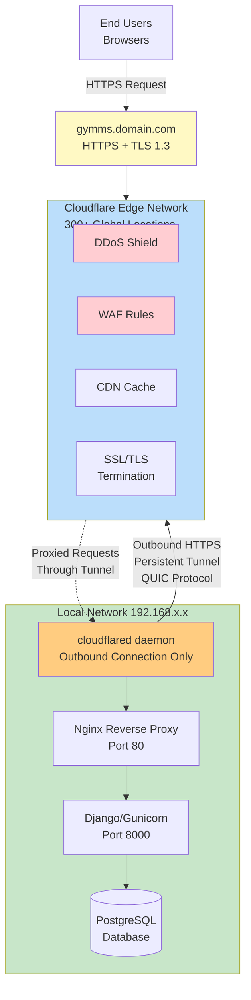

**Key Features to Highlight:**
- ✅ No port forwarding required
- ✅ No static IP needed
- ✅ Origin server IP hidden
- ✅ Automatic SSL certificates
- ✅ DDoS protection at edge
- ✅ Zero inbound firewall rules

**To Render:**
- Copy to GitHub markdown file
- Use https://mermaid.live/
- Or use VS Code Mermaid Preview extension
